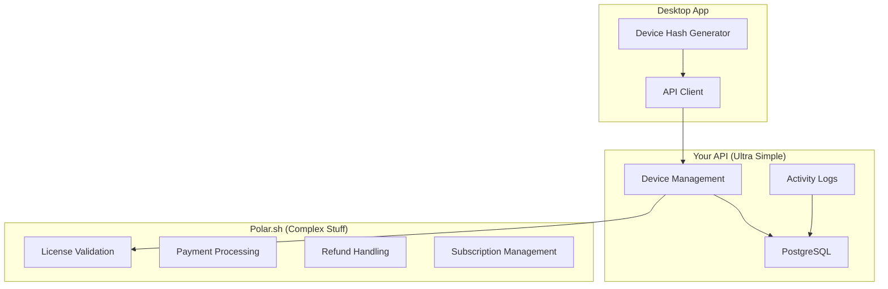
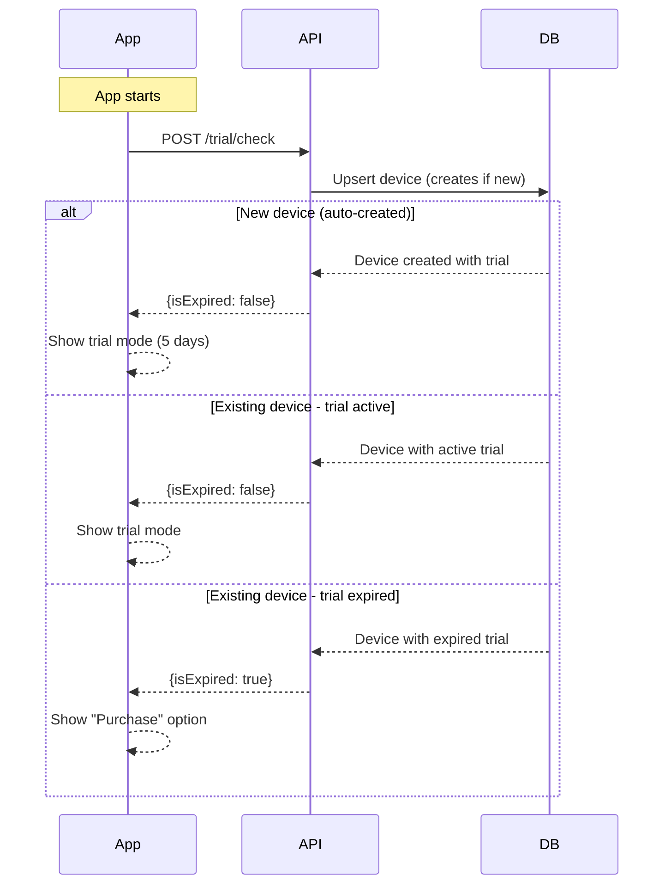
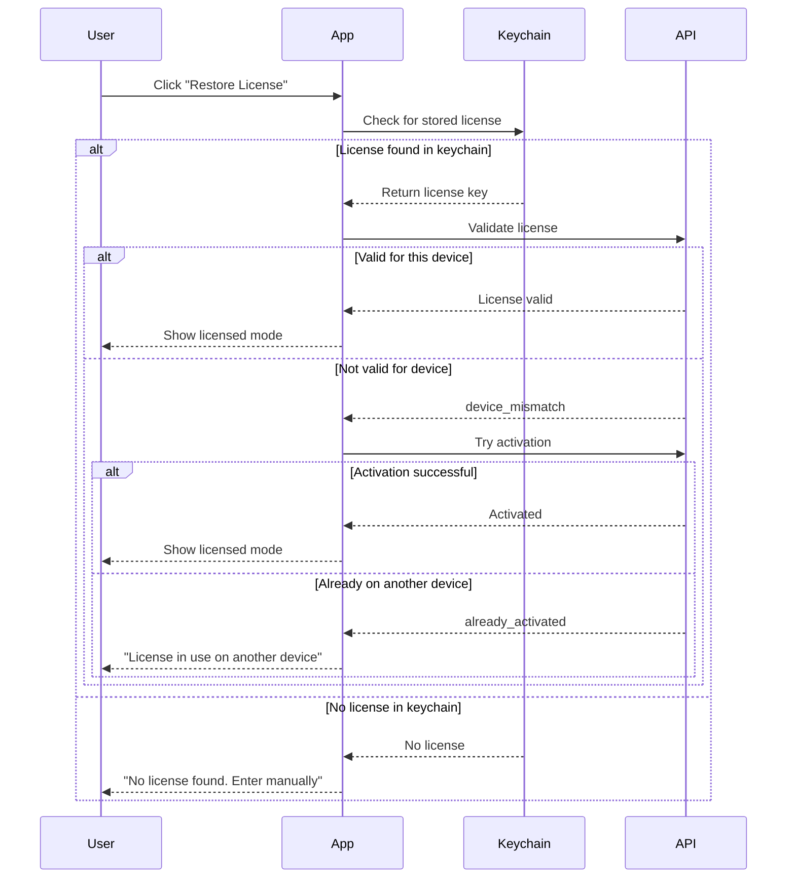

# VoiceTypr License & Trial Management API - Simplified Architecture

## Why This System?

### Business Goals
- **Monetize effectively** while keeping it simple
- **Prevent piracy** without complex systems
- **Zero maintenance** - Let Polar handle the hard stuff
- **Scale effortlessly** - Minimal moving parts

### Technical Philosophy
- **Polar is the license server** - We don't duplicate their work
- **We only track device bindings** - Which device uses which license
- **Activity logs for everything** - Easy debugging
- **No state synchronization** - No complex update logic

## What We're Building

### System Components



### Core Features

| Feature | What It Does | Who Handles It |
|---------|--------------|----------------|
| **Device Identification** | SHA256 hash of machine UUID | Your API |
| **5-Day Trial** | One per device forever | Your API |
| **License Validation** | Is license valid? | Polar |
| **Device Binding** | Which device uses which license | Your API |
| **Payment/Refunds** | All money stuff | Polar |

## How It Works

### 1. Device Identification

```typescript
// Desktop app
const machineId = getMachineUUID();
const deviceHash = sha256(machineId);
// Send deviceHash to API
```

### 2. App Start Flow (Trial Check)



### 3. License Restore Flow (User-Initiated)



### 4. License Activation (Desktop App Flow)

```typescript
// In your desktop app
async function activateLicense(licenseKey: string) {
  try {
    // 1. Call activation endpoint
    const response = await fetch('https://voicetypr.com/api/v1/license/activate', {
      method: 'POST',
      headers: { 'Content-Type': 'application/json' },
      body: JSON.stringify({
        licenseKey,
        deviceHash: getDeviceHash()
      })
    });

    if (response.ok) {
      const data = await response.json();
      // Success! Save license to keychain
      await keychain.save('license', licenseKey);
      showLicensedMode();
      return { success: true, activatedAt: data.data.activatedAt };
    }

    // Handle specific errors
    const error = await response.json();
    if (error.error === 'license_already_activated') {
      return { 
        success: false, 
        error: 'This license is already activated on another device' 
      };
    }
    
    return { success: false, error: error.message };
  } catch (error) {
    return { success: false, error: 'Network error' };
  }
}

// What happens on the server:
// 1. Check if license already bound to another device
// 2. Call Polar to activate the license
// 3. Store device binding with customer ID
// 4. Return success with activation timestamp
```

### 5. License Validation (Desktop App Flow)

```typescript
// In your desktop app - periodic validation (e.g., on app start, every 24h)
async function validateLicense() {
  const licenseKey = await keychain.get('license');
  if (!licenseKey) return { valid: false };

  try {
    const response = await fetch('https://voicetypr.com/api/v1/license/validate', {
      method: 'POST',
      headers: { 'Content-Type': 'application/json' },
      body: JSON.stringify({
        licenseKey,
        deviceHash: getDeviceHash(),
        appVersion: getAppVersion()
      })
    });

    const data = await response.json();
    
    if (data.data.valid) {
      // License is valid
      updateLastValidatedTime();
      return { valid: true };
    }

    // License not valid
    await keychain.delete('license');
    showUnlicensedMode();
    return { valid: false };
  } catch (error) {
    // Network error - check offline grace period
    const lastValidated = await getLastValidatedTime();
    const daysSince = (Date.now() - lastValidated) / (1000 * 60 * 60 * 24);
    
    if (daysSince < 7) {
      showOfflineIndicator();
      return { valid: true, offline: true };
    }
    
    return { valid: false, error: 'Cannot validate offline' };
  }
}

// What happens on the server:
// 1. Check if device has this license binding
// 2. Validate with Polar using stored customer ID
// 3. Update last checked timestamp
// 4. Return validation result
```

### 6. Device Transfer (Desktop App Flow)

```typescript
// In your desktop app - user wants to transfer license
async function deactivateLicense() {
  const licenseKey = await keychain.get('license');
  if (!licenseKey) return { success: false, error: 'No license found' };

  try {
    const response = await fetch('https://voicetypr.com/api/v1/license/deactivate', {
      method: 'POST',
      headers: { 'Content-Type': 'application/json' }, 
      body: JSON.stringify({
        licenseKey,
        deviceHash: getDeviceHash()
      })
    });

    if (response.ok) {
      const data = await response.json();
      // Success! Remove from keychain
      await keychain.delete('license');
      showUnlicensedMode();
      return { 
        success: true, 
        message: 'License deactivated. You can now use it on another device.',
        deactivatedAt: data.data.deactivatedAt
      };
    }

    const error = await response.json();
    if (error.error === 'not_your_license') {
      // License doesn't belong to this device
      await keychain.delete('license');
      return { success: false, error: 'This license is not activated on this device' };
    }
    
    return { success: false, error: error.message };
  } catch (error) {
    return { success: false, error: 'Network error' };
  }
}

// What happens on the server:
// 1. Verify device owns this license
// 2. Call Polar to deactivate
// 3. Clear license binding (keep device record)
// 4. Return success with deactivation timestamp
```

## Database Schema (Ultra Simplified)

```sql
-- Just 2 tables!

-- 1. Devices (everything in one place)
CREATE TABLE devices (
  device_hash VARCHAR(64) PRIMARY KEY,
  device_name VARCHAR(255),
  
  -- License fields (NULL = no license)
  license_key VARCHAR(255),
  customer_id VARCHAR(255),
  
  -- Trial fields (NULL = no trial)
  trial_started_at TIMESTAMP,
  trial_expires_at TIMESTAMP,
  
  -- Timestamps
  created_at TIMESTAMP DEFAULT NOW(),
  last_seen TIMESTAMP DEFAULT NOW(),
  last_checked TIMESTAMP DEFAULT NOW(),
  
  INDEX idx_customer (customer_id),
  INDEX idx_license (license_key)
);

-- 2. Activity Logs (debugging gold)
CREATE TABLE activity_logs (
  id VARCHAR(32) PRIMARY KEY,
  timestamp TIMESTAMP DEFAULT NOW(),
  device_hash VARCHAR(64) NOT NULL,
  action VARCHAR(50) NOT NULL,
  metadata JSONB,
  INDEX idx_device_time (device_hash, timestamp)
);
```

## API Endpoints (Same Interface, Simpler Logic)

### Base URL
```
https://voicetypr.com/api/v1
```

### Trial Endpoints
- `POST /trial/check` - Check if eligible for trial
- `POST /trial/activate` - Start 5-day trial

### License Endpoints
- `POST /license/activate` - Bind license to device
- `POST /license/validate` - Check if license valid (via Polar)
- `POST /license/deactivate` - Remove device binding

### Webhook Endpoint
- `POST /webhooks/polar` - Handle refunds/cancellations

## Key Implementation Details

### No More Complex State Management
```typescript
// OLD: Complex state tracking
if (license.status === 'active' &&
    license.lastValidated < 24h &&
    license.isActive &&
    !license.revoked) { ... }

// NEW: Just ask Polar
const valid = await polar.validateLicenseKey(licenseKey);
```

### Simple Device Transfers
```typescript
// OLD: Rate limiting, deactivation logs, complex checks
// NEW: Just clear the license fields
await db.device.update({
  where: { deviceHash },
  data: { licenseKey: null, customerId: null }
});
```

### Webhook Handling
```typescript
// When Polar says license is revoked/refunded
export const POST = Webhooks({
  onPayload: async (payload) => {
    switch (payload.type) {
      case 'order.refunded':
        // Clear license from all devices for this customer
        await db.device.updateMany({
          where: { customerId: payload.data.customerId },
          data: {
            licenseKey: null,
            customerId: null
          }
        });
        break;

      case 'checkout.updated':
        // Log checkout updates for tracking
        await db.activityLog.create({
          data: {
            deviceHash: "webhook",
            action: "checkout_updated",
            metadata: {
              checkoutId: payload.data.id,
              customerId: payload.data.customerId,
              status: payload.data.status
            }
          }
        });
        break;

      case 'benefit_grant.created':
        // Log benefit grants for tracking
        await db.activityLog.create({
          data: {
            deviceHash: "webhook",
            action: "benefit_granted",
            metadata: {
              benefitId: payload.data.benefit?.id,
              customerId: payload.data.customerId,
              orderId: payload.data.orderId
            }
          }
        });
        break;
    }
  }
});
```

## Business Rules (Simplified)

```typescript
const RULES = {
  // Trials
  trialDurationDays: 5,
  trialsPerDevice: 1,

  // Licenses
  devicesPerLicense: 1, // Enforced by unique constraint

  // Validation
  offlineGracePeriodDays: 7,

  // No more complex rules needed!
};
```

## Why This Architecture Wins

### 🚀 Performance
- Validation: ~50ms (just check Polar)
- Activation: ~100ms (one upsert)
- Deactivation: ~20ms (one delete)

### 🛠 Maintenance
- No license state to sync
- No complex migrations
- Polar handles all edge cases

### 🐛 Debugging
- Everything in activity logs
- Clear audit trail
- No mysterious state issues

### 💰 Cost
- Minimal database storage
- Few API calls
- No complex compute

## Migration Notes

If migrating from complex system:
1. Keep trial data (already simple)
2. Migrate device-license bindings only
3. Drop all license state/status data
4. Simplify API routes
5. Test with Polar webhooks

## Success Metrics

- **Code Reduction**: ~70% less code
- **Bug Reduction**: ~90% fewer edge cases
- **Support Tickets**: Near zero for license issues
- **Developer Happiness**: Through the roof 🚀

---

This simplified architecture leverages Polar as the license authority while maintaining minimal local state. The result is a robust, maintainable system that "just works".