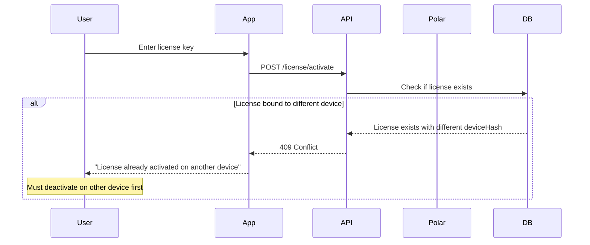
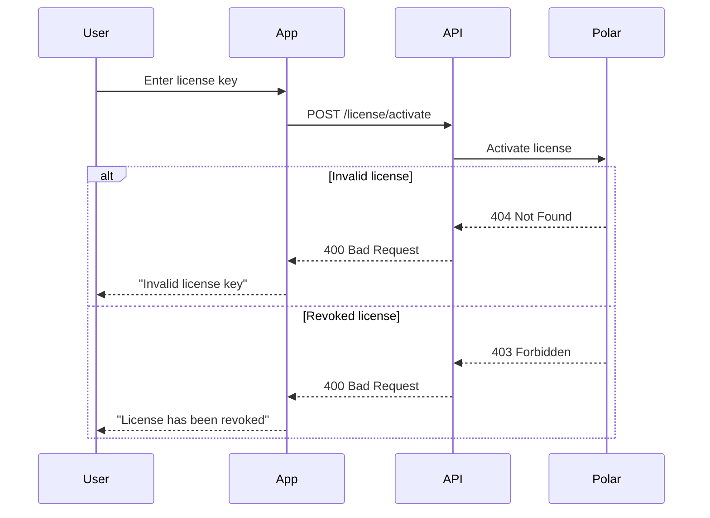
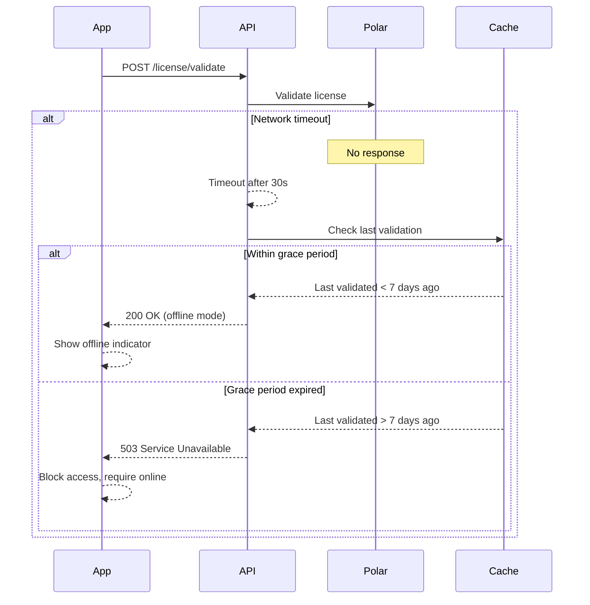
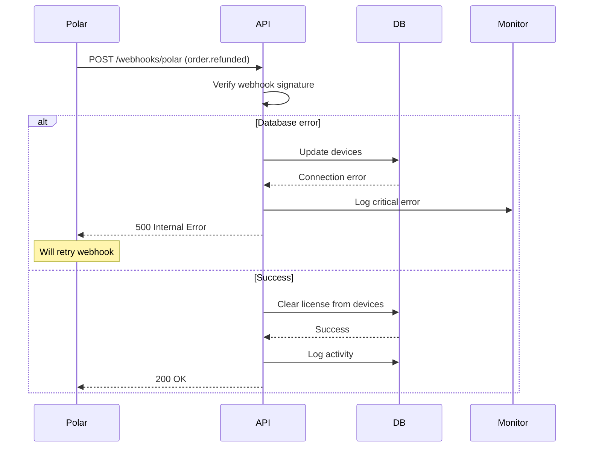
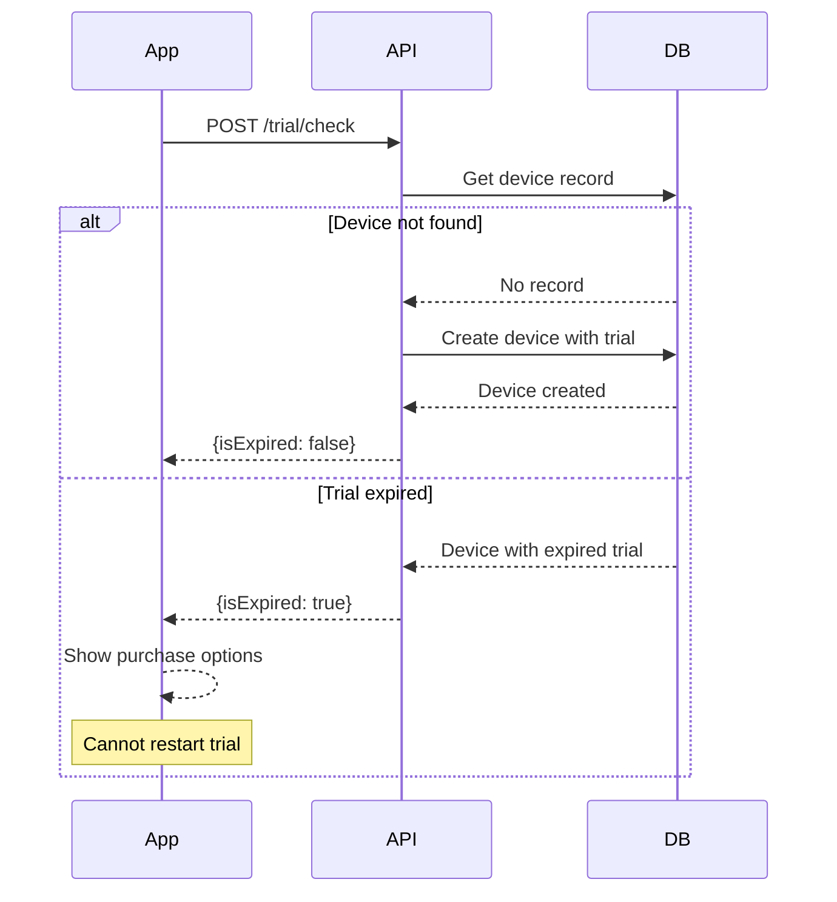
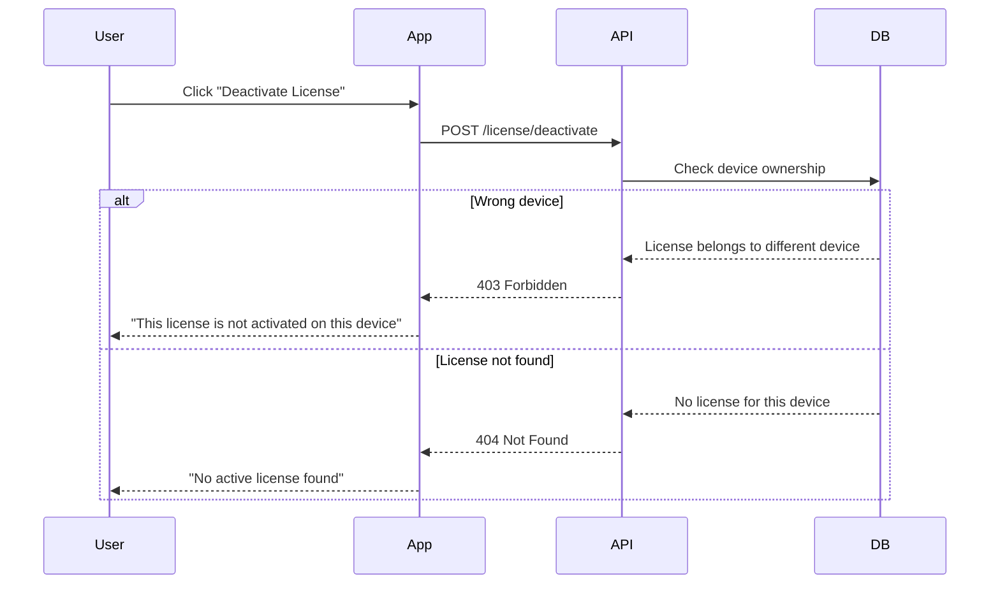

# VoiceTypr API Documentation

**Version:** 1.0.0
**Last Updated:** January 17, 2025
**Authors:** VoiceTypr Development Team

## Implementation Status: ✅ **COMPLETE**

All endpoints and features described in this documentation have been implemented and are ready for production use.

## Overview

The VoiceTypr API provides license and trial management for the desktop application. It acts as a simple wrapper around Polar.sh for license validation while managing device-specific features like trials and device bindings.

## Architecture Philosophy

- **Polar.sh** manages all license data (validity, payments, refunds)
- **Our API** only manages device bindings and trials
- **No duplicate data** - Polar is the single source of truth
- **User-initiated license flow** - License management happens via explicit user actions

## User Flow

### App Start
1. Desktop app starts → Check trial status only
2. Show trial mode, expired state, or purchase options
3. No automatic license checks on startup

### License Restore (User Action)
1. User clicks "Restore License" in settings
2. App checks keychain for stored license
3. If found → Validate → If valid, show licensed mode
4. If not found or invalid → User enters license manually

### Key Design Decision
The desktop app handles the logic of choosing between trial and license modes. The API endpoints remain simple and focused - trial endpoints handle trials, license endpoints handle licenses. No cross-checking or complex state management.

## Base URL

```
https://voicetypr.com/api/v1
```

## Authentication

All API requests must include a device hash in the request body:

```json
{
  "deviceHash": "sha256_hash_of_machine_uuid"
}
```

The device hash should be:
- Generated on the desktop app by hashing the machine UUID
- 64 characters long (SHA256 hex string)
- Lowercase hexadecimal format

## Endpoints

### Trial Management

#### Check Trial Status
```http
POST /trial/check
Content-Type: application/json

{
  "deviceHash": "a3f5b8c12d..."
}
```

**Response:**
```json
{
  "success": true,
  "data": {
    "isExpired": false  // false = trial active, true = trial expired
  }
}
```

**Note:** This endpoint automatically creates a device record with a 5-day trial if the device doesn't exist.

#### Activate Trial
**Note:** This endpoint is not currently implemented. Trial activation happens automatically when calling `/trial/check` for a new device.

### License Management

#### Activate License
Validates the license with Polar and creates a device binding. This is called when:
- User enters a new license key
- User clicks "Restore License" and validation fails (attempting to transfer license)

```http
POST /license/activate
Content-Type: application/json

{
  "licenseKey": "polar_key_xxxx",
  "deviceHash": "a3f5b8c12d..."
}
```

**Response:**
```json
{
  "success": true,
  "data": {
    "activatedAt": "2024-01-07T12:00:00Z"
  }
}
```

**Error Response (if already activated elsewhere):**
```json
{
  "success": false,
  "error": "license_already_activated",
  "message": "License is already activated on another device"
}
```

#### Validate License
Checks if device has a license binding and validates it with Polar. Used when:
- User clicks "Restore License" and a license is found in keychain
- Periodic validation checks (if implemented)

```http
POST /license/validate
Content-Type: application/json

{
  "licenseKey": "polar_key_xxxx",
  "deviceHash": "a3f5b8c12d...",
  "appVersion": "1.0.0"  // Optional but recommended
}
```

**Response:**
```json
{
  "success": true,
  "data": {
    "valid": true
  }
}
// OR if not valid
{
  "success": true,
  "data": {
    "valid": false
  },
  "message": "Device mismatch"  // Or other error message
}
```

**Note:** The API validates with Polar using the stored customer ID. If validation fails due to network issues, the client should implement offline grace period logic.

#### Deactivate License
Removes the device binding, allowing the license to be used on another device.

```http
POST /license/deactivate
Content-Type: application/json

{
  "licenseKey": "polar_key_xxxx",
  "deviceHash": "a3f5b8c12d..."
}
```

**Response:**
```json
{
  "success": true,
  "data": {
    "deactivatedAt": "2024-01-07T12:00:00Z"
  }
}
```

## Error Handling

All errors follow this format:
```json
{
  "success": false,
  "error": "error_code",
  "message": "Human readable error message"
}
```

Common error codes:
- `validation_error` - Invalid request parameters
- `license_already_activated` - License is already activated on another device
- `not_your_license` - Trying to deactivate a license not bound to this device
- `invalid_license` - License key is invalid (from Polar)
- `device_mismatch` - License belongs to different device
- `internal_error` - Server error occurred

## Database Schema

The ultra-simplified schema with everything in one Device model:

```prisma
// One model to rule them all - a device can have a trial, a license, or neither
model Device {
  deviceHash String   @id

  // License fields (null = no license)
  licenseKey   String?  // The license key (references License table)
  activationId String?  // Polar activation ID for deactivation

  // Trial fields (null = no trial)
  trialStartedAt DateTime?
  trialExpiresAt DateTime?

  // Timestamps
  createdAt   DateTime
  lastChecked DateTime // For offline grace period
  appVersion  String?  // Last known app version

  activities ActivityLog[]
}

model ActivityLog {
  id         String   @id
  timestamp  DateTime
  deviceHash String
  action     String   // 'trial_start', 'activate', 'deactivate', 'validate', 'order_refunded'
  metadata   Json?
}
```

## Setup Instructions

1. **Install dependencies:**
   ```bash
   pnpm install
   ```

2. **Set up database:**
   ```bash
   pnpm prisma generate
   pnpm prisma db push
   ```

3. **Configure environment variables:**
   ```env
   DATABASE_URL="postgresql://..."
   POLAR_ACCESS_TOKEN="your_token"
   POLAR_ORGANIZATION_ID="your_org_id"
   POLAR_WEBHOOK_SECRET="your_secret"
   ```

4. **Run development server:**
   ```bash
   pnpm dev
   ```

## Webhook Configuration

Configure webhook in Polar dashboard:
- URL: `https://voicetypr.com/api/webhooks/polar`
- Events:
  - `order.refunded` - When an order is refunded (removes device bindings)
  - `checkout.updated` - When checkout status changes (logged for tracking)
  - `benefit_grant.created` - When license benefits are granted (logged for tracking)

The webhook handler will automatically clear license data (set licenseKey and activationId to null) when licenses are revoked or refunded, preserving the device record for history. License records are managed in a separate licenses table. Other events are logged for tracking and debugging purposes.

## Error Scenario Flows

### License Already Activated on Another Device



### Invalid License Key



### Network Failure During Validation



### Webhook Processing Failure



### Trial Expired Check



### Deactivation Permission Denied



## Testing
# Check trial (auto-creates device with trial)
curl -X POST http://localhost:3000/api/v1/trial/check \
  -H "Content-Type: application/json" \
  -d '{"deviceHash": "a3f5b8c12d4e6f7890abcdef1234567890abcdef1234567890abcdef12345678"}'

# Activate license
curl -X POST http://localhost:3000/api/v1/license/activate \
  -H "Content-Type: application/json" \
  -d '{
    "deviceHash": "a3f5b8c12d4e6f7890abcdef1234567890abcdef1234567890abcdef12345678",
    "licenseKey": "test_license_key"
  }'

# Validate license
curl -X POST http://localhost:3000/api/v1/license/validate \
  -H "Content-Type: application/json" \
  -d '{
    "deviceHash": "a3f5b8c12d4e6f7890abcdef1234567890abcdef1234567890abcdef12345678",
    "licenseKey": "test_license_key",
    "appVersion": "1.0.0"
  }'

# Deactivate license
curl -X POST http://localhost:3000/api/v1/license/deactivate \
  -H "Content-Type: application/json" \
  -d '{
    "deviceHash": "a3f5b8c12d4e6f7890abcdef1234567890abcdef1234567890abcdef12345678",
    "licenseKey": "test_license_key"
  }'
```

## Key Implementation Details

### Desktop App Responsibilities
- Store license key in secure keychain
- Decide whether to check trial or license on startup
- Handle "Restore License" user flow
- Show appropriate UI based on trial/license state

### API Responsibilities
- Validate licenses with Polar
- Track device bindings
- Manage trial periods
- Handle webhooks for license revocations

### Restore License Flow (Desktop Implementation)
```typescript
async function restoreLicense() {
  const licenseKey = keychain.get('license');
  if (!licenseKey) return { error: 'No license found' };

  // Try validation first
  const validateResult = await api.validateLicense(licenseKey, deviceHash);

  if (validateResult.valid) {
    return { success: true };
  }

  if (validateResult.reason === 'device_mismatch') {
    // Try activation (could be first time or device transfer)
    try {
      await api.activateLicense(licenseKey, deviceHash);
      return { success: true };
    } catch (error) {
      if (error.code === 'license_already_activated') {
        return { error: 'License activated on another device' };
      }
    }
  }

  return { error: 'Invalid license' };
}
```

## Key Differences from Complex Implementation

1. **Single Device Model** - Everything in one table, no joins needed
2. **No License Details Storage** - Just track which device has which license
3. **Always Check Polar** - Every validation goes to Polar (with grace period)
4. **Simple Deactivation** - Just clear license fields, device record remains
5. **Activity Logs** - Everything is logged for debugging
6. **No Rate Limiting** - Not needed with simple binding approach
7. **Customer ID Tracking** - Store Polar customer ID to handle webhooks properly
8. **User-Initiated License Management** - No automatic license checks on startup
9. **Preserved Device History** - Devices never deleted, preventing abuse

## Changelog

### Version 1.0.0 (January 17, 2025)
- Initial release with complete API implementation
- Added comprehensive error scenario diagrams
- Full integration with Polar.sh
- Trial and license management endpoints
- Webhook support for order lifecycle events
